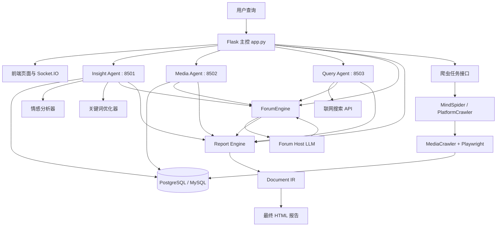
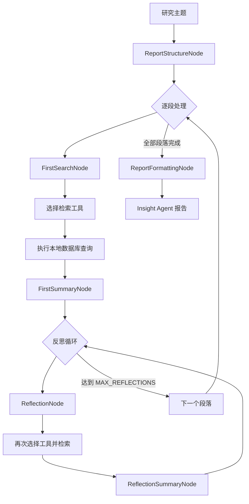

# BettaFish 现状架构与报表生成链路

## 1. 文档目的

这份文档回答 3 个问题：

1. 现在这套 BettaFish 实际是怎么工作的。
2. 为什么它会表现出“多轮检索、长时间处理、报表容易发散”的特征。
3. 当前生成的最终报告，为什么更像“舆情研究报告”，而不是“经营情报报告”。

## 2. 当前系统定位

从项目说明看，当前 BettaFish 的默认定位是“多智能体舆情分析系统”，重点是：

- 多平台社媒采集
- 多 Agent 并行研究
- 论坛式协作
- 最后由 Report Engine 装订成长篇 HTML 报告

代码和 README 对现状的支持非常明确：

- `README.md` 将产品定义为“多智能体舆情分析系统”。
- `README.md` 将核心角色定义为 Insight / Media / Query / Report 四类 Agent。
- `README.md` 同时说明它可以改造成金融或市场分析系统，但那是“二次改造能力”，不是当前默认行为。

## 3. 当前运行组件

当前在线运行版可以拆成 6 个层级：

### 3.1 接入层

- Flask 主控应用
- 前端页面
- Socket.IO 日志推送

主控应用统一暴露：

- 系统启动/停止
- 配置读写
- 原始帖子搜索
- 爬虫任务启动与状态查询
- Report Engine 任务入口

### 3.2 三个研究 Agent

- `Insight Agent`
  - 主要使用本地舆情数据库做深度挖掘
  - 带关键词优化、情感分析、本地库检索

- `Media Agent`
  - 主要处理多模态/多媒体内容
  - 更偏图文、视频、热点内容理解

- `Query Agent`
  - 主要走联网检索
  - 更偏新闻、网页、公开资料搜索

### 3.3 Forum 协作层

- `ForumEngine`
  - 监听各引擎日志
  - 由主持人模型生成“论坛主持意见”
  - 各 Agent 在总结和反思阶段可以读取最新主持发言

这意味着当前系统并不是三个 Agent 各做各的，而是会被一个额外的“论坛主持人”继续引导。

### 3.4 Report Engine

`Report Engine` 不只是把三个结果拼起来，而是自己还有独立的生成管线：

- 模板选择
- 模板切片
- 文档布局
- 字数规划
- 逐章生成
- JSON 修复
- IR 装订
- HTML 渲染

所以“最终报告”本身也是一个重处理链路。

### 3.5 数据层

- PostgreSQL 或 MySQL
- MediaCrawler 入库数据
- 本地检索工具从数据库统一读取

### 3.6 爬虫层

- `MindSpider`
- `MediaCrawler`
- Playwright 浏览器
- 各平台登录态持久化目录

## 4. 当前整体架构图

Mermaid 原文件见：

- `docs/architecture/diagrams/01_current_multi_agent_overall.mmd`

## 5. 当前多 Agent 的工作原理

当前系统不是“一问一答”，而是“多阶段研究”。

### 5.1 入口阶段

用户发起一个研究主题后：

1. Flask 主控接收请求。
2. Insight / Media / Query 三个 Agent 并行启动。
3. ForumEngine 也开始监听日志并参与协作。
4. Report Engine 在后续阶段读取三份结果和论坛记录。

### 5.2 每个 Agent 的内部基本形态

Insight / Media / Query 三支 Agent 都不是只搜一次。

它们内部基本都遵循：

1. 先生成报告结构。
2. 将报告拆成多个段落。
3. 对每个段落先做一次“首次搜索”。
4. 对该段落生成首次总结。
5. 再进入多轮“反思 -> 再搜索 -> 再总结”。
6. 所有段落完成后，再格式化成 Agent 自己的一份完整报告。

所以你看到“不断处理不同段落”“一直在反思”的现象，不是卡死，而是设计本身如此。

## 6. 当前检索轮次到底有多少

这是最重要的定量部分。

### 6.1 Insight Agent

根据当前代码：

- 最大段落数：`MAX_PARAGRAPHS = 6`
- 每段首次搜索：1 次
- 每段反思轮次：`MAX_REFLECTIONS = 3`

因此：

- 每段最多检索 4 次
- 全 Agent 最多检索 `6 x 4 = 24` 次

注意：

- 这 24 次是“检索动作”
- 每次检索后还会跟一个总结动作
- 所以实际 LLM 调用次数更多

### 6.2 Query Agent

根据当前配置：

- 最大段落数：`MAX_PARAGRAPHS = 5`
- 每段首次搜索：1 次
- 每段反思轮次：`MAX_REFLECTIONS = 2`

因此：

- 每段最多搜索 3 次
- 全 Agent 最多搜索 `5 x 3 = 15` 次

### 6.3 Media Agent

根据当前配置：

- 最大段落数：`MAX_PARAGRAPHS = 5`
- 每段首次搜索：1 次
- 每段反思轮次：`MAX_REFLECTIONS = 2`

因此：

- 每段最多搜索 3 次
- 全 Agent 最多搜索 `5 x 3 = 15` 次

### 6.4 三支 Agent 理论检索总量

按默认配置上限估算：

- Insight：24 次
- Query：15 次
- Media：15 次

合计：

- 理论最多 54 次检索/搜索动作

这还不包括：

- Forum Host 的主持发言生成
- Report Engine 的模板选择与章节生成
- JSON 修复与图表修复

所以它不是“快响应型搜索工具”，而是“重研究型分析流水线”。

## 7. Insight Agent 详细链路

Insight 是当前最能代表这套系统“为什么慢、为什么容易跑偏”的引擎。

它的流程可拆为：

1. 生成报告结构
2. 为每个段落生成搜索词和工具选择
3. 执行本地库检索
4. 生成首次段落总结
5. 进入最多 3 轮反思搜索
6. 每轮反思都会再次生成查询、再次搜库、再次总结
7. 所有段落完成后，再统一做最终格式化

### 7.1 Insight 详细图

Mermaid 原文件见：

- `docs/architecture/diagrams/01_current_insight_loop.mmd`

## 8. ForumEngine 在里面到底干什么

ForumEngine 不直接负责检索，而是做“协作引导层”。

它的价值是：

- 监听三个 Agent 的日志与讨论
- 生成主持人意见
- 被总结节点读取，注入到下一轮总结中

这会带来两个结果：

### 优点

- 有机会减少三个 Agent 完全各说各话
- 有机会让不同角度互相补充

### 代价

- 研究链更长
- 结果更容易“继续发散”
- 如果主持人方向不准，会把三个引擎一起带偏

## 9. Report Engine 的真实工作

当前 Report Engine 不是“拼接器”，而是“第二套重生成引擎”。

它的核心阶段是：

1. 接收 Query / Media / Insight 报告和论坛日志
2. 自动选模板
3. 切模板成章节
4. 设计文档标题、目录、视觉主题
5. 规划章节字数
6. 按章节调用 LLM 生成结构化 JSON
7. 将章节 JSON 装订成 Document IR
8. 渲染为 HTML 报告

这解释了两个现象：

- 即使前面 3 个引擎都完成了，你还会继续看到长时间“在生成 report”
- 最终报告风格不是原封不动来自某一个 Agent，而是被 Report Engine 二次重写过

## 10. 当前报表为什么会“跑偏”

当前默认报表容易偏成泛舆情，根本原因不是单个模型，而是整条链路都在做这件事。

### 10.1 提示词导向是舆情

Insight 提示词里明确要求：

- 挖掘真实民意和公众观点
- 关注情感分布
- 关注争议焦点
- 关注平台差异

### 10.2 关键词优化器会主动“口语化”

关键词优化器的目标是把查询改写成：

- 网民表达
- 口语化短词
- 带情绪词
- 适合社媒检索

这对“品牌舆情”有帮助，但对“经营、门店、财报、供应链”并不天然友好。

### 10.3 报告模板本身就是长篇舆情报告

当前默认格式强调：

- 情感倾向
- 民意热点
- 代表性评论
- 社会心理
- 舆情建议

所以只要还沿用这套模板，哪怕数据里有经营信息，最后也容易被写成“公众讨论报告”。

## 11. 当前最终输出是什么

当前最终产物通常是：

- 一份 HTML 报告
- 来源是 Report Engine 装订后的 Document IR
- 不是数据库查询结果列表
- 不是轻量运营看板
- 更像一份研究型长文报告

因此：

- 它适合“全面研究一个公共议题”
- 不适合“快速搜几条茶饮门店动态，然后形成业务简报”

## 12. 现状判断

当前 BettaFish 更像：

- 多轮研究系统
- 多 Agent 舆情报告工厂
- 重生成、重装订

而不是：

- 面向业务运营的即时检索后台
- 固定字段的经营情报系统
- 轻量爬虫落库平台

## 13. 为什么这份现状报告重要

如果不先承认这套现状，后面会出现两个误区：

1. 误以为“只改一点 prompt 就能变成经营平台”
2. 误以为“它现在慢只是性能问题，不是架构问题”

实际都不是。

现阶段最准确的判断是：

- 它现在的默认架构是“舆情型、研究型、长链路”
- 要变成“茶饮经营情报平台”，应该重设产品目标和输出 schema
- 要变成“纯爬虫落库平台”，则应该单独裁掉 AI 研究链路
