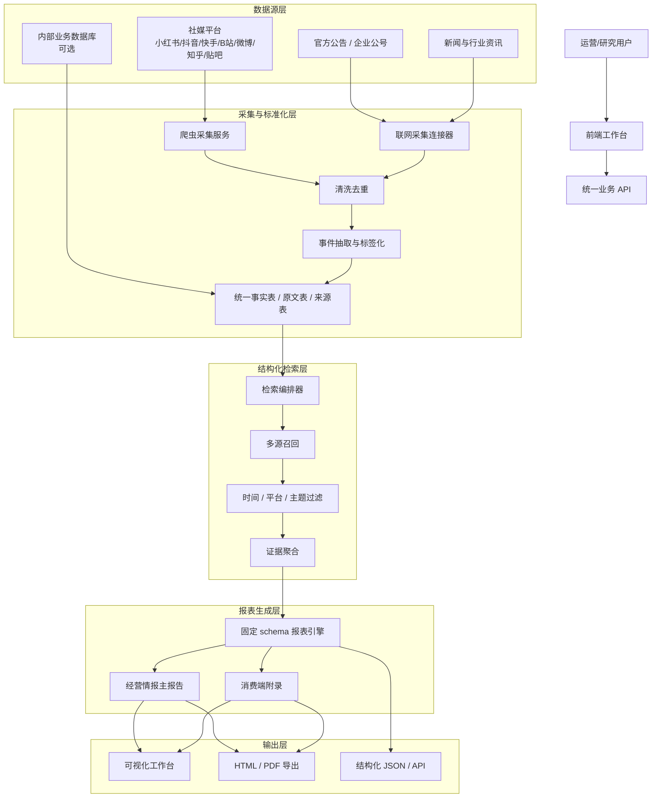

# 茶饮经营情报平台目标方案

## 1. 目标定义

这里定义的不是“茶饮舆情平台加强版”，而是一个新的目标产品：

**茶饮经营情报平台**

它的核心目标不是泛舆情，而是围绕“品牌经营信息”形成可复用、可控、可读的结构化报表。

## 2. 产品定位

### 2.1 平台要解决的问题

针对茶饮品牌，你真正关心的通常不是：

- 某一轮舆情情绪有多热
- 网友的感性表达有多丰富

而是：

- 最近 24 小时 / 7 天 / 30 天有什么值得关注的动态
- 门店扩张、闭店、加盟、选址、招商有没有变化
- 财报、融资、合作、供应链、原材料、政策、食品安全有没有新信号
- 抖音、小红书、快手、B 站上的消费端内容是否能辅助判断经营动向

所以目标产品应该是：

- 经营情报主报表
- 舆情/消费端信号作为附录

### 2.2 目标产物

目标产物应当是：

- 固定结构的业务简报
- 可比较的周期报告
- 可追溯的原始来源列表
- 可扩展到看板的结构化数据

不再是默认一万字长篇研究报告。

## 3. 目标产品原则

### 3.1 原始数据优先

先看到来源，再做总结，避免“结论先行”。

### 3.2 经营情报优先

门店、加盟、财报、供应链、监管、竞品优先级高于情绪化讨论。

### 3.3 固定 schema 优先

输出要尽量稳定为固定字段，而不是每次都被模型重新发明章节。

### 3.4 舆情降级为附录

舆情保留，但不再做主轴。

## 4. 目标报表 Schema

以下是建议固定的目标报表结构。

## 4.1 顶层字段

```yaml
report_meta:
  brand: 茶饮
  generated_at:
  period:
  filters:
    platforms:
    time_range:
    sort_by:
    keywords:

executive_summary:
  key_findings:
  top_risks:
  top_opportunities:
  action_points:

market_activity:
  latest_events:
  key_timelines:
  official_announcements:

store_network:
  new_store_signals:
  store_closure_signals:
  franchise_and_investment_signals:
  regional_distribution_clues:

financial_and_capital:
  financing_news:
  earnings_or_financial_clues:
  investment_and_partner_signals:

supply_chain:
  raw_material_signals:
  supplier_or_factory_signals:
  logistics_and_distribution_signals:
  food_safety_and_regulatory_signals:

competitor_context:
  key_competitors:
  comparative_moves:
  category_trends:

consumer_market_appendix:
  content_hotspots:
  platform_breakdown:
  sample_posts:
  notable_comments:

evidence:
  official_sources:
  news_sources:
  social_posts:
  database_hits:

recommendations:
  immediate_actions:
  watchlist:
  data_gaps:
```

## 4.2 章节级解释

### A. 执行摘要

应该是：

- 5 到 8 条结论
- 3 条主要风险
- 3 条主要机会
- 3 到 5 条建议动作

不应该是：

- 大段情绪描述
- 长篇散文式引言

### B. 市场与品牌动态

优先关注：

- 官方公众号
- 公司公告
- 新闻报道
- 渠道合作
- 新品、联名、招商动态

### C. 门店网络

重点输出：

- 新增门店线索
- 区域扩张线索
- 闭店或经营异常线索
- 加盟政策和招商信号

### D. 财务与资本

重点输出：

- 融资消息
- 经营指标线索
- 投资/合作/资本动作

### E. 供应链与监管

重点输出：

- 原材料价格/供应波动
- 工厂、供应商、仓配信息
- 食品安全、抽检、通报、监管消息

### F. 消费端附录

这部分保留社媒内容，但目的不是做主报告，而是补充：

- 热门内容
- 平台差异
- 用户反馈样本
- 可疑风险苗头

## 5. 目标架构图



Mermaid 原文件见：

- `docs/architecture/diagrams/02_tea_drink_target_architecture.mmd`

## 6. 目标引擎怎么精简

当前多 Agent 设计太重，不适合你要的业务形态。建议收敛为 4 个核心模块。

### 6.1 数据采集层

职责：

- 按平台采集
- 按时间采集
- 按关键词采集
- 落库

### 6.2 结构化检索层

职责：

- 按品牌、时间、平台、主题检索
- 聚合事实
- 提供原始证据列表

### 6.3 经营报表引擎

职责：

- 严格按 schema 出报告
- 章节固定
- 字段固定
- 用证据填充，不自由发散

### 6.4 舆情附录引擎

职责：

- 抖音/小红书/快手/B 站消费端信号
- 热帖与评论样本
- 风险话题提示

这意味着：

- `ForumEngine` 可以先取消
- `Insight Engine` 需要改造成“结构化检索编排器”
- `Report Engine` 需要改造成“固定 schema 报表器”
- `Media Engine` 从主引擎降级为附录引擎

## 7. 当前引擎到目标引擎的映射关系

### 当前

- Insight：舆情数据库深挖
- Media：多模态舆情分析
- Query：联网资料补充
- Forum：协作式主持
- Report：长篇舆情装订

### 目标

- Ingestion Engine：数据采集与入库
- Retrieval Engine：结构化检索与证据聚合
- Business Report Engine：经营情报主报表
- Market Appendix Engine：消费端/社媒附录

## 8. 推荐的数据优先级

如果做“茶饮经营情报平台”，数据优先级建议改成：

### 一级

- 官方公告
- 新闻与行业资讯
- 监管与抽检信息
- 门店/招商/加盟/合作线索

### 二级

- 供应链、原材料、工厂、物流信息
- 竞品品牌动向

### 三级

- 小红书、抖音、快手、B站内容
- 消费者讨论与评论

这会直接改变系统的输出气质。

## 9. 目标前端形态

前端不应该再只有“研究主题输入框”。

建议改成 3 个工作区：

### 9.1 搜索区

- 品牌词
- 平台
- 时间范围
- 排序
- 主题标签

### 9.2 原始数据区

- 原始帖子 / 原始新闻 / 原始公告列表
- 支持分页
- 支持来源回跳

### 9.3 报表区

- 一键生成经营情报报告
- 固定章节
- 可导出

## 10. 难易度评估

### 低难度

- 改标题、改前端文案
- 保留现有 Agent，只换报表模板

结果：

- 可暂时缓解
- 但本质仍然偏舆情

### 中难度

- 固定 schema
- 收紧检索范围
- 降低 Forum 权重
- 将社媒结果降级为附录

结果：

- 这是最值得做的一档
- 产品形态会明显接近经营平台

### 高难度

- 接入内部业务数据库
- 接入官方与行业结构化源
- 构建可复用指标口径

结果：

- 才会真正像企业级经营情报系统

## 11. 我建议你怎么定产品边界

如果现在就要把形态定死，我建议你定成：

### 产品名

茶饮经营情报平台

### 产品主轴

- 最新经营动态
- 门店与加盟
- 财务与资本
- 供应链与监管
- 竞品与行业

### 产品附录

- 抖音 / 小红书 / 快手 / B站 / 微博 的消费端内容

### 非目标

- 不追求泛社会舆情大论文
- 不追求多 Agent 长链讨论感
- 不追求每次都完全自由生成章节

## 12. 这份方案的作用

这份目标方案一旦定下来，后面无论你要我改前端、改搜索、改报表、改 Docker，都能围绕同一套产品边界推进，而不会继续在“舆情平台”和“经营情报平台”之间摇摆。
