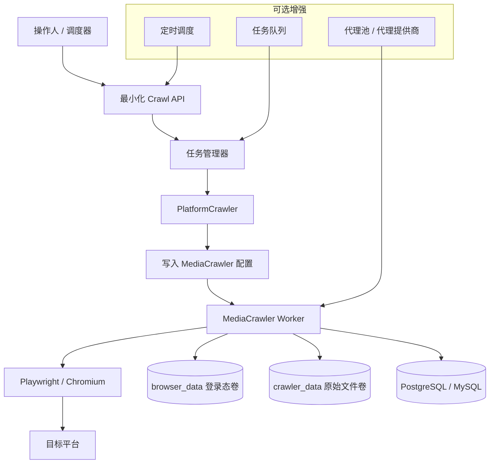

# 纯爬虫搜索落库版方案

## 1. 目标定义

这个方案只保留一件事：

**按关键词搜索平台内容，并把结果落库。**

暂时不考虑：

- 原始数据查询后台
- AI 分析
- 多 Agent
- 报表生成

所以这是一版“搜索落库服务”，不是完整情报平台。

## 2. 当前代码已经具备的基础

现有 BettaFish 里，爬虫这一部分其实已经相对独立：

- Flask 提供了 `/api/crawl/start`
- 任务由 `PlatformCrawler` 驱动
- 实际执行由 `MediaCrawler + Playwright` 完成
- 采集后可以直接写入 DB

目前支持的平台有：

- 小红书 `xhs`
- 抖音 `dy`
- 快手 `ks`
- B站 `bili`
- 微博 `wb`
- 贴吧 `tieba`
- 知乎 `zhihu`

## 3. 当前纯爬虫链路

Mermaid 原文件见：

- `docs/architecture/diagrams/03_crawler_only_architecture.mmd`

## 4. 你的关键问题 1：目前是不是只要扫码并保留登录状态即可

结论：

**大体上是的，但要分“首次登录”和“后续复用”两个阶段。**

### 4.1 首次登录

当前默认方式是：

- `LOGIN_TYPE = qrcode`
- 每个平台第一次使用都需要登录
- 扫码成功后会保存浏览器状态

当前外层 Docker 默认也开启了：

- `MEDIACRAWLER_SAVE_LOGIN_STATE=true`
- `crawler_browser_data` 目录挂载持久化

这意味着首次扫码后，浏览器状态会尽量复用。

### 4.2 后续运行

如果登录态仍有效：

- 后续任务通常不需要再次扫码
- 可以直接复用 `browser_data` 中的状态

如果登录态失效：

- 平台风控
- Cookie 过期
- 设备校验变化
- 账号被挤掉

则需要重新扫码或重新登录。

### 4.3 当前实际建议

如果以后要上 Linux 服务器，我建议这样做：

1. 先在本地或带界面的环境完成首次扫码登录。
2. 保留 `crawler_browser_data`。
3. 再把这个目录挂到服务器容器里继续跑。

因为纯 headless 远程服务器上第一次扫码和处理滑块验证，运维体验通常很差。

## 5. 你的关键问题 2：能不能添加代理功能

结论：

**能，而且底层已经有代理能力，但当前 BettaFish 外层没有把它做成现成开关。**

## 5.1 底层已经支持的部分

`MediaCrawler` 底层已经有：

- `ENABLE_IP_PROXY`
- `IP_PROXY_POOL_COUNT`
- `IP_PROXY_PROVIDER_NAME`
- 代理池逻辑
- 代理提供商
- 浏览器启动时的代理参数

已看到的提供商包括：

- `kuaidaili`
- `wandouhttp`

这说明：

- 代理不是要从零做
- 底层能力是现成的

## 5.2 当前外层 BettaFish 的缺口

目前外层 `app.py` 的爬虫接口只暴露了：

- `platform`
- `keywords`
- `login_type`
- `max_notes`
- `auto_analyze`

没有现成暴露：

- 是否启用代理
- 使用哪个代理商
- 代理池数量
- 代理凭证

所以现状是：

- **底层支持代理**
- **当前 BettaFish 这个 UI/API 封装层未完整暴露代理配置**

## 5.3 如果后面要做，难度如何

### 低到中

- 直接在 MediaCrawler 配置层手工打开代理
- 固定写死单一代理商

### 中

- 在 `.env` 暴露代理参数
- 在 Flask API 中透传代理配置
- 在任务级别支持是否启用代理

### 中到高

- 做平台级代理策略
- 做任务级代理切换
- 做代理池刷新与可用性监控

## 6. 纯爬虫版建议保留哪些组件

如果你只要“搜索落库”，建议只保留下面这些：

### 必需

- PostgreSQL 或 MySQL
- 最小化 Crawl API
- PlatformCrawler / MediaCrawler
- Playwright 浏览器
- 登录态持久化卷
- 数据持久化卷

### 可选

- 定时调度器
- 任务队列
- 代理池
- 简单任务状态页

### 不需要

- Insight Agent
- Media Agent
- Query Agent
- ForumEngine
- Report Engine

## 7. 最小部署架构

最小可运行版本建议如下：

### 7.1 单容器版

适合：

- 自测
- 开发环境
- 轻量服务器

组成：

- Crawl API
- MediaCrawler
- Playwright
- DB 连接

### 7.2 双容器版

适合：

- 稳定运行
- Linux 服务器

组成：

- `crawler-service`
- `postgres`

### 7.3 三组件版

适合：

- 后面要加定时任务
- 后面要加任务排队

组成：

- `crawler-api`
- `crawler-worker`
- `postgres`

## 8. 当前你至少要准备什么

## 8.1 必需配置

- `DB_DIALECT`
- `DB_HOST`
- `DB_PORT`
- `DB_USER`
- `DB_PASSWORD`
- `DB_NAME`

## 8.2 运行环境

- Docker
- Linux 或 Windows
- Playwright 浏览器依赖

## 8.3 持久化目录

- 登录态目录
- 原始采集数据目录
- 数据库数据目录

## 8.4 平台登录方式

当前底层支持：

- `qrcode`
- `phone`
- `cookie`

但在实际运维上，最稳定的起点仍然是：

- 先扫码登录
- 再长期复用登录态

## 8.5 代理相关准备

如果要上代理，通常还要准备：

- 代理商账号
- 代理凭证
- 代理池数量策略
- 代理失效刷新策略

## 9. 这版服务的能力边界

这版服务应该只承诺：

- 指定平台
- 指定关键词
- 指定采集量
- 运行采集任务
- 数据写入数据库

不承诺：

- 智能分析
- 自动成文报告
- 原始数据看板
- 精准经营结论

## 10. 后面如果你要继续扩展，推荐路线

推荐按这个顺序做：

### 第一步

先把“采集稳定 + 落库稳定 + 登录态稳定”跑稳。

### 第二步

再加“简单查询接口”：

- 按关键词
- 按平台
- 按时间
- 按最新 / 按热度

### 第三步

最后再考虑 AI：

- 总结
- 标注
- 分类
- 风险提示

这样最稳。

## 11. 难易度评估

### 扫码后复用登录态

- 难度：低

### 纯爬虫单独 Docker 化

- 难度：中低

### Linux 稳定运行

- 难度：中

### 代理能力接入到现有外层 API

- 难度：中

### 多平台代理池策略

- 难度：中到高

## 12. 最终判断

如果你的近期目标只是：

- 搜索
- 抓取
- 落库

那完全没必要带着现在整套多 Agent 跑。

最佳方案是：

- 直接裁掉 AI 研究链
- 留下爬虫执行层
- 留下数据库
- 留下最小化任务 API

这会更适合部署到 Linux 服务器，也更符合你后面做数据资产沉淀的方向。

