# 茶饮经营情报平台页面信息架构

## 1. 这份文档解决什么问题

前一份目标方案已经把产品边界定成了“经营情报平台”，这份文档继续往下落到页面层：

1. 首页应该有什么。
2. 用户怎样完成“搜原始数据 -> 看证据 -> 生成报表”。
3. 哪些页面是一期开、哪些可以二期再开。

这份文档默认：

- 桌面端优先
- 运营/研究人员是主用户
- 数据可信度高于炫技式 AI 交互

## 2. 用户角色

建议先只定义 2 类角色。

### 2.1 研究员 / 运营

权限：

- 发起原始搜索
- 查看帖子、新闻、公告原文
- 发起采集任务
- 生成报表
- 导出 HTML / PDF / Excel

### 2.2 管理员

额外权限：

- 配置平台账号与登录态
- 配置代理和调度
- 管理模型和 API Key
- 查看任务日志与系统健康

## 3. 页面总导航

建议左侧一级导航固定成 6 个模块。

1. 总览 Dashboard
2. 原始搜索 Raw Search
3. 采集任务 Crawl Tasks
4. 情报报表 Reports
5. 数据资产 Data Assets
6. 系统配置 Settings

如果你想先压缩一期范围，可以只上 4 个：

1. 原始搜索
2. 采集任务
3. 情报报表
4. 系统配置

## 4. 页面总结构图

```mermaid
flowchart TD
    APP[茶饮经营情报平台]
    APP --> DASH[总览 Dashboard]
    APP --> SEARCH[原始搜索]
    APP --> CRAWL[采集任务]
    APP --> REPORT[情报报表]
    APP --> DATA[数据资产]
    APP --> SETTINGS[系统配置]

    DASH --> D1[今日动态]
    DASH --> D2[任务状态]
    DASH --> D3[平台覆盖]
    DASH --> D4[风险预警]

    SEARCH --> S1[筛选栏]
    SEARCH --> S2[结果列表]
    SEARCH --> S3[详情抽屉]
    SEARCH --> S4[加入报表]

    CRAWL --> C1[创建任务]
    CRAWL --> C2[二维码登录]
    CRAWL --> C3[任务日志]
    CRAWL --> C4[任务历史]

    REPORT --> R1[报表模板]
    REPORT --> R2[证据池]
    REPORT --> R3[章节预览]
    REPORT --> R4[导出中心]

    DATA --> A1[来源表]
    DATA --> A2[平台数据量]
    DATA --> A3[关键词命中]
    DATA --> A4[事件标签]

    SETTINGS --> T1[平台账号]
    SETTINGS --> T2[代理配置]
    SETTINGS --> T3[调度配置]
    SETTINGS --> T4[模型配置]
```

Mermaid 原文件见：

- `docs/architecture/diagrams/04_tea_drink_page_ia.mmd`

## 5. 核心工作流

这个产品的核心工作流不应该是“一句话研究”，而应该是 3 步。

### 第一步：先搜原始数据

用户先确定：

- 品牌词
- 时间范围
- 平台
- 排序方式
- 主题标签

然后先看：

- 原始帖子列表
- 原始新闻列表
- 原始公告列表

### 第二步：再做证据筛选

用户从原始列表中挑选：

- 哪些值得纳入报表
- 哪些是噪音
- 哪些是门店/财务/供应链/监管线索

### 第三步：最后生成报表

报表不是直接吃“所有搜索结果”，而是吃：

- 搜索条件
- 证据池
- 固定 schema

这样输出会稳很多。

## 6. 各页面详细定义

## 6.1 总览 Dashboard

目标：

- 不是拿来做研究
- 是拿来快速知道“今天系统里有什么值得看”

建议组件：

- 今日新增内容数
- 最近 24 小时平台命中数
- 最近采集任务状态
- 最近生成报表
- 风险预警卡片
- 最近 7 天主题分布

推荐首屏布局：

- 顶部：品牌选择 + 时间范围
- 第一行：4 个 KPI 卡片
- 第二行：平台覆盖图 + 任务状态
- 第三行：风险预警 + 最新动态

## 6.2 原始搜索页

这是最核心的一页。

建议三栏布局。

### 左栏：筛选区

字段：

- 品牌词
- 关键词
- 平台多选
- 时间范围
- 排序方式
- 内容类型
- 主题标签

动作：

- 搜索
- 清空
- 保存条件

### 中栏：结果列表

每条结果卡建议显示：

- 标题/正文预览
- 平台
- 发布时间
- 作者
- 互动数据
- 来源关键词
- 标签

动作：

- 查看详情
- 收藏证据
- 标记为门店/加盟/财务/供应链/监管
- 从结果集移除

### 右栏：详情区

显示：

- 原文全文
- 原始链接
- 原图/封面
- 评论摘要
- 相似内容
- 已加入哪个报表

## 6.3 采集任务页

这一页面向“数据生产”。

建议拆成 4 个面板。

### A. 创建任务

字段：

- 平台
- 关键词
- 采集量
- 登录方式
- 是否启用代理
- 调度方式

### B. 二维码登录面板

显示：

- 当前平台
- 当前登录状态
- 二维码图片
- 登录提示

### C. 任务日志

显示：

- 启动时间
- 运行日志
- 错误日志
- 落库统计

### D. 历史任务

显示：

- 任务 ID
- 平台
- 关键词
- 状态
- 新增内容数
- 新增评论数
- 启动时间

## 6.4 情报报表页

这是“经营情报平台”的核心消费页。

建议拆成 4 个区块。

### A. 报表配置区

字段：

- 品牌
- 周期
- 报表类型
- 平台范围
- 是否包含消费端附录

### B. 证据池区

显示：

- 已选择的证据条数
- 证据分类
- 来源分布

动作：

- 删除
- 改标签
- 设为主证据

### C. 报表预览区

章节固定展示：

- 执行摘要
- 市场与品牌动态
- 门店网络
- 财务与资本
- 供应链与监管
- 竞品与行业
- 消费端附录

### D. 导出区

动作：

- 导出 HTML
- 导出 PDF
- 导出 JSON
- 导出证据清单 Excel

## 6.5 数据资产页

这是二期增强页。

目标：

- 不直接做研究
- 做数据运营和资产沉淀

建议内容：

- 平台数据量趋势
- 关键词命中趋势
- 高价值来源列表
- 已标注事件统计
- 报表引用率

## 6.6 系统配置页

建议分 5 个 Tab。

1. 平台账号与登录态
2. 代理配置
3. 模型与 API Key
4. 调度与限速
5. 系统健康与日志

## 7. 一期和二期边界

## 7.1 一期必须做

- 原始搜索页
- 采集任务页
- 情报报表页
- 系统配置页

## 7.2 二期增强

- Dashboard
- 数据资产页
- 风险预警页
- 多品牌切换

## 8. 页面状态机

最关键的是“原始搜索页”和“采集任务页”。

### 搜索页状态

- idle
- loading
- loaded
- empty
- error

### 采集任务页状态

- created
- waiting_login
- running
- completed
- failed

### 报表页状态

- evidence_empty
- ready_to_generate
- generating
- generated
- export_ready

## 9. 推荐交互顺序

建议前端默认引导用户按这个顺序使用：

1. 先去“采集任务”补数据
2. 再去“原始搜索”查结果
3. 选证据后进入“情报报表”
4. 最后导出

而不是一上来就直接问 AI。

## 10. 为什么这一版 IA 适合你

因为你当前最大的痛点不是“页面太少”，而是：

- 现在没有把“原始数据”和“AI 报表”分开
- 用户不知道系统到底在处理什么
- 研究链路太长、太黑盒

这版 IA 的核心就是把系统拆明：

- 数据生产
- 数据检索
- 证据筛选
- 报表生成

## 11. 实施建议

如果后面真正开始改页面，建议按顺序做：

1. 先把“原始搜索”做成主页面
2. 再把“采集任务”做顺
3. 最后补“情报报表”

这比先做炫酷大屏更稳。
