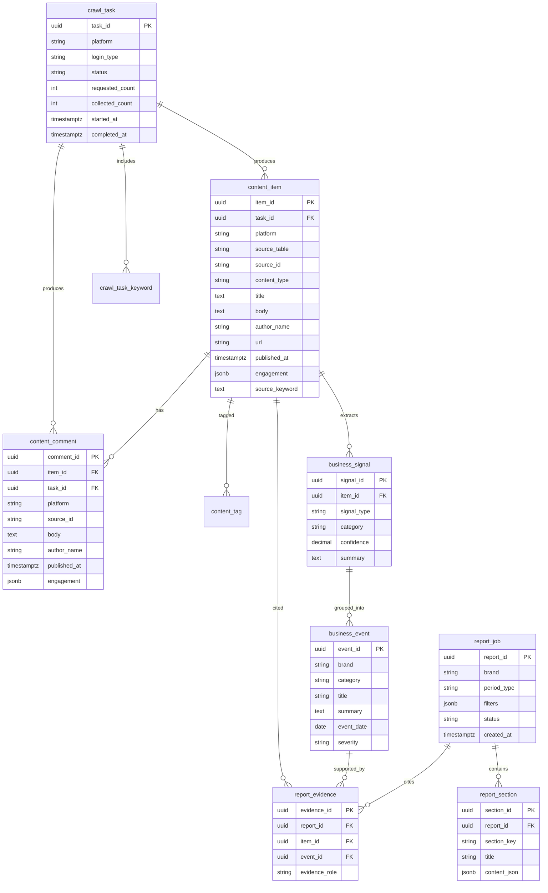

# 茶饮经营情报平台数据库设计

## 1. 设计目标

数据库设计要解决 4 个问题：

1. 兼容当前 MediaCrawler 已经存在的平台原始表。
2. 让跨平台检索变简单，而不是每次对 7 张平台表做拼装。
3. 支持“门店 / 财务 / 供应链 / 监管”等业务标签化。
4. 支持报表生成时的证据追溯。

## 2. 现状约束

当前 BettaFish / MindSpider 已经有大量平台原始表，例如：

- `douyin_aweme`
- `kuaishou_video`
- `bilibili_video`
- `weibo_note`
- 以及其他平台的 note / comment / creator 类表

这些表的共同特点：

- 已经能落原始数据
- 字段命名因平台而异
- 都有类似 `source_keyword`、`create_time`、`crawling_task_id`
- 但跨平台统一查询不够舒服

所以目标不是推翻原始表，而是在上面再加一层“统一索引与事件层”。

## 3. 推荐分层

建议数据库拆成 3 层。

### 3.1 L0 原始采集层

保留现有平台表，不做大改。

职责：

- 真实原始数据落地
- 保留平台字段差异
- 方便排障和回溯

### 3.2 L1 统一检索层

新增统一检索表。

职责：

- 跨平台统一检索
- 统一时间、互动数、内容类型
- 统一品牌词与来源任务映射

### 3.3 L2 业务事件层

新增业务事件与报表表。

职责：

- 把原始内容升维成业务事件
- 支持固定 schema 报表
- 支持证据管理

## 4. 核心数据模型图

Mermaid 原文件见：

- `docs/architecture/diagrams/05_tea_drink_data_model.mmd`

## 5. 一期推荐表设计

一期不要追求全量标准化，优先做最小够用表。

### 5.1 `crawl_task`

用途：

- 统一管理采集任务
- 和当前 `crawling_task_id` 保持对应

建议字段：

- `task_id`
- `platform`
- `keywords_json`
- `login_type`
- `status`
- `requested_count`
- `collected_count`
- `proxy_enabled`
- `proxy_provider`
- `started_at`
- `completed_at`
- `error_message`

### 5.2 `crawl_task_keyword`

用途：

- 一次任务可能有多个关键词

建议字段：

- `id`
- `task_id`
- `keyword`
- `keyword_type`

### 5.3 `content_item`

用途：

- 平台原始内容统一索引表
- 搜索页主列表直接查这张表

建议字段：

- `item_id`
- `task_id`
- `platform`
- `source_table`
- `source_id`
- `content_type`
- `title`
- `body`
- `author_id`
- `author_name`
- `url`
- `cover_url`
- `published_at`
- `engagement_json`
- `source_keyword`
- `brand`
- `raw_payload_json`

### 5.4 `content_comment`

用途：

- 评论统一索引

建议字段：

- `comment_id`
- `item_id`
- `task_id`
- `platform`
- `source_table`
- `source_id`
- `body`
- `author_name`
- `published_at`
- `engagement_json`
- `raw_payload_json`

### 5.5 `content_tag`

用途：

- 对内容打业务标签

建议标签：

- `store`
- `franchise`
- `finance`
- `supply_chain`
- `food_safety`
- `regulation`
- `competitor`
- `consumer_feedback`

## 6. 二期推荐表设计

二期开始引入“业务信号”和“业务事件”。

### 6.1 `business_signal`

这张表不是完全人工，也可以由规则或 AI 半自动抽取。

典型信号：

- 疑似开店
- 疑似闭店
- 疑似加盟政策变化
- 疑似原料供应波动
- 疑似抽检通报

### 6.2 `business_event`

用途：

- 将多个 signal 汇聚成一个真正业务事件

例如：

- “茶饮华东区域扩店”
- “某批次原料供应波动”
- “某城市监管抽检通报”

## 7. 报表层表设计

### 7.1 `report_job`

用途：

- 管理一次报表生成任务

字段建议：

- `report_id`
- `brand`
- `report_type`
- `period_type`
- `filters_json`
- `status`
- `created_by`
- `created_at`
- `completed_at`

### 7.2 `report_section`

用途：

- 固定 schema 各章节的结构化存储

建议 `section_key`：

- `executive_summary`
- `market_activity`
- `store_network`
- `financial_and_capital`
- `supply_chain`
- `competitor_context`
- `consumer_market_appendix`
- `recommendations`

### 7.3 `report_evidence`

用途：

- 让每段报表都能回到证据

这张表非常关键，因为它决定了报表是否可追溯。

## 8. 与当前原始平台表的关系

建议不要一上来把现有平台表改没。

正确做法是：

1. 平台原始表继续保留
2. 新增统一索引表
3. 用 ETL / 同步任务把原始表映射到统一索引表

这样有 3 个好处：

- 兼容现有采集逻辑
- 出问题时容易定位
- 后续可以逐步演进而不是一次性大迁移

## 9. 建议的同步策略

### 9.1 近实时同步

每次采集任务完成后：

- 写原始表
- 再写统一索引表

### 9.2 夜间修复同步

每日夜间做一次：

- 去重
- 补标签
- 纠正时间字段
- 生成聚合统计

## 10. 索引建议

最重要的索引优先加在统一索引层。

### `content_item`

- `(brand, published_at desc)`
- `(platform, published_at desc)`
- `(source_keyword)`
- `GIN(title/body)` 或全文索引
- `(task_id)`

### `content_comment`

- `(item_id)`
- `(platform, published_at desc)`
- 全文索引

### `business_event`

- `(brand, category, event_date desc)`
- `(severity, event_date desc)`

### `report_job`

- `(brand, created_at desc)`
- `(status, created_at desc)`

## 11. PostgreSQL 建议

如果后面放 Linux 服务器，建议优先 PostgreSQL。

原因：

- JSONB 更适合存 engagement 和 raw payload
- 全文检索更方便
- 物化视图、分区、CTE 都更适合分析型场景

## 12. 分阶段实施建议

### 阶段 A：最小可用

- 保留原始平台表
- 新增 `crawl_task`
- 新增 `content_item`
- 新增 `content_comment`
- 新增 `content_tag`

### 阶段 B：经营情报化

- 新增 `business_signal`
- 新增 `business_event`
- 新增 `report_job`
- 新增 `report_section`
- 新增 `report_evidence`

### 阶段 C：企业化

- 多品牌
- 数据权限
- 审核流
- 指标口径表

## 13. 你现在最应该做哪一层

如果你现在马上要推进，我建议先做：

- `crawl_task`
- `content_item`
- `content_comment`

因为这 3 张表一落，前台“原始搜索页”就有统一数据源了。
