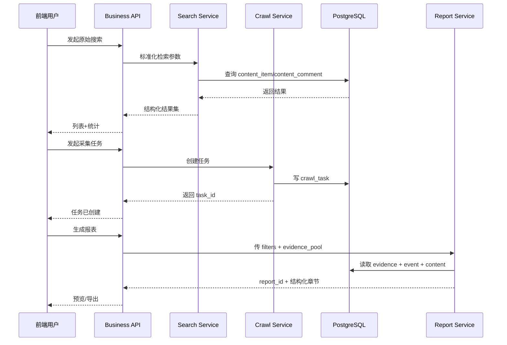

# 茶饮经营情报平台 API 设计

## 1. 设计目标

API 设计要同时满足两件事：

1. 兼容当前 BettaFish 已经存在的接口习惯。
2. 为后续“经营情报平台”留出清晰的资源边界。

所以建议：

- 对外逐步切到 `/api/v1/*`
- 对内短期保留现有 `/api/search/raw`、`/api/crawl/start`

## 2. API 模块划分

建议拆成 5 组。

1. Search API
2. Crawl API
3. Report API
4. Asset API
5. System API

## 3. API 总流程图



Mermaid 原文件见：

- `docs/architecture/diagrams/06_tea_drink_api_flow.mmd`

## 4. Search API

## 4.1 原始搜索

### 推荐接口

`POST /api/v1/search/raw`

### 用途

- 跨平台检索原始内容
- 支持时间、平台、排序
- 返回帖子列表和平台分布

### 请求体

```json
{
  "brand": "茶饮",
  "query": "茶饮",
  "platforms": ["xhs", "dy", "ks", "bili"],
  "time_range": "7d",
  "sort_by": "latest",
  "limit": 20,
  "content_types": ["post", "video"],
  "tags": ["store", "franchise"]
}
```

### 返回体

```json
{
  "success": true,
  "query": "茶饮",
  "filters": {
    "platforms": ["xhs", "dy", "ks", "bili"],
    "time_range": "7d",
    "sort_by": "latest",
    "limit": 20
  },
  "total_matches": 138,
  "returned_count": 20,
  "platform_breakdown": {
    "xhs": 8,
    "dy": 6,
    "ks": 3,
    "bili": 3
  },
  "results": []
}
```

### 和当前接口的关系

当前已有：

- `/api/search/raw`

建议做法：

- 一期先继续复用当前接口
- 二期再平滑迁到 `/api/v1/search/raw`

## 4.2 单条内容详情

`GET /api/v1/search/items/{item_id}`

返回：

- 内容正文
- 原始链接
- 评论摘要
- 互动数据
- 原图/封面
- 标签

## 4.3 评论检索

`POST /api/v1/search/comments`

用途：

- 对评论做单独检索
- 支持按 item_id 或 query 查

## 4.4 搜索筛选字典

`GET /api/v1/search/filters/meta`

返回：

- 平台列表
- 时间范围列表
- 排序方式
- 标签列表

## 5. Crawl API

## 5.1 创建采集任务

### 推荐接口

`POST /api/v1/crawl/tasks`

### 请求体

```json
{
  "platform": "xhs",
  "keywords": ["茶饮", "茶饮加盟"],
  "login_type": "qrcode",
  "max_notes": 50,
  "schedule_type": "manual",
  "proxy": {
    "enabled": false,
    "provider": ""
  }
}
```

### 返回体

```json
{
  "success": true,
  "task": {
    "task_id": "crawl_20260401_xxx",
    "status": "created"
  }
}
```

### 当前兼容接口

当前已有：

- `/api/crawl/start`
- `/api/crawl/status`
- `/api/crawl/qrcode`

这三条完全可以作为一期兼容层保留。

## 5.2 查询任务状态

`GET /api/v1/crawl/tasks/{task_id}`

返回：

- 任务状态
- 平台
- 关键词
- 已采数量
- 错误信息
- 日志摘要

## 5.3 获取二维码

`GET /api/v1/crawl/tasks/{task_id}/qrcode`

用途：

- 首次扫码登录

## 5.4 停止任务

`POST /api/v1/crawl/tasks/{task_id}/stop`

用途：

- 人工终止长任务

## 5.5 历史任务列表

`GET /api/v1/crawl/tasks`

筛选条件：

- platform
- status
- date_from
- date_to

## 6. Report API

## 6.1 创建报表任务

`POST /api/v1/reports`

请求体建议：

```json
{
  "brand": "茶饮",
  "report_type": "business_intelligence",
  "period_type": "7d",
  "filters": {
    "platforms": ["xhs", "dy", "ks", "bili", "wb"],
    "time_range": "7d"
  },
  "evidence_item_ids": [
    "item_1",
    "item_2",
    "item_3"
  ],
  "include_consumer_appendix": true
}
```

## 6.2 获取报表详情

`GET /api/v1/reports/{report_id}`

返回：

- 顶层元数据
- 各章节结构化内容
- 证据引用
- 生成状态

## 6.3 导出报表

`GET /api/v1/reports/{report_id}/export?format=html`

可选：

- `html`
- `pdf`
- `json`
- `xlsx`

## 6.4 报表章节单独读取

`GET /api/v1/reports/{report_id}/sections/{section_key}`

用途：

- 前端分章加载
- 支持局部刷新

## 7. Asset API

## 7.1 证据池管理

`POST /api/v1/assets/evidence`

用途：

- 把原始内容加入证据池

### 请求体

```json
{
  "item_id": "item_xxx",
  "tags": ["store", "franchise"],
  "note": "疑似加盟推广线索"
}
```

## 7.2 标签管理

`GET /api/v1/assets/tags`

`POST /api/v1/assets/tags`

## 7.3 事件列表

`GET /api/v1/assets/events`

用途：

- 查询已经抽取好的 business_event

## 8. System API

## 8.1 健康检查

`GET /api/v1/system/health`

返回：

- api
- db
- crawler
- search
- report

## 8.2 配置读取与更新

可兼容当前：

- `GET /api/config`
- `POST /api/config`

未来建议拆成：

- `GET /api/v1/system/config`
- `POST /api/v1/system/config`

## 8.3 平台登录状态

`GET /api/v1/system/platform-sessions`

返回：

- 平台
- 是否已登录
- 登录态更新时间
- 是否建议重新扫码

## 9. 一期 API 最小集合

如果你要最快跑起来，一期只做这些就够：

### Search

- `POST /api/v1/search/raw`
- `GET /api/v1/search/items/{item_id}`

### Crawl

- `POST /api/v1/crawl/tasks`
- `GET /api/v1/crawl/tasks/{task_id}`
- `GET /api/v1/crawl/tasks/{task_id}/qrcode`

### Report

- `POST /api/v1/reports`
- `GET /api/v1/reports/{report_id}`
- `GET /api/v1/reports/{report_id}/export`

### System

- `GET /api/v1/system/health`

## 10. 兼容迁移策略

建议你不要一次性全切。

### 第一阶段

保留现在：

- `/api/search/raw`
- `/api/crawl/start`
- `/api/crawl/status`
- `/api/crawl/qrcode`

### 第二阶段

新增 `/api/v1/*`

### 第三阶段

前端完全切到 `/api/v1/*`

### 第四阶段

旧接口只保留兼容层或废弃

## 11. 你现在最值得保留的接口习惯

从当前项目看，最值得保留的现有设计是：

- 原始搜索和 AI 搜索分开
- 采集任务与二维码接口分开
- 配置读写独立

这些方向是对的，不需要推翻。
