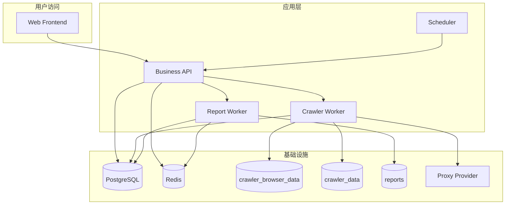

# 茶饮经营情报平台 Docker / Linux 拆分部署方案

## 1. 目标

这份文档回答 3 个部署问题：

1. 只保留爬虫落库时，Docker 怎么拆。
2. 做到“原始搜索 + 报表”时，服务怎么拆。
3. 真正上 Linux 服务器时，哪些东西必须持久化，哪些需要特别注意。

## 2. 推荐思路

不要一上来就做“大一统容器”。

建议按 3 种阶段形态逐步演进：

1. Crawler Only
2. Search Platform
3. Full Intelligence Platform

## 3. 三种部署形态

## 3.1 形态 A：Crawler Only

适合：

- 现在马上要用
- 只关心搜索落库
- 先不上 AI

服务建议：

- `crawler-api`
- `crawler-worker`
- `postgres`

如果想更省，也可以把 `crawler-api` 和 `crawler-worker` 合并为一个服务。

## 3.2 形态 B：Search Platform

适合：

- 已经有稳定采集
- 要做前端原始搜索

服务建议：

- `web`
- `api`
- `crawler-worker`
- `postgres`
- `redis` 可选

## 3.3 形态 C：Full Intelligence Platform

适合：

- 后续要上经营情报报表
- 要做任务队列和异步报表生成

服务建议：

- `web`
- `api`
- `crawler-worker`
- `report-worker`
- `postgres`
- `redis`
- `scheduler`

## 4. 服务拆分图

Mermaid 原文件见：

- `docs/architecture/diagrams/07_tea_drink_docker_split.mmd`

## 5. 形态 A：Crawler Only 详细建议

### 最小服务

- `crawler-service`
- `postgres`

### 服务职责

`crawler-service`

- 提供任务创建 API
- 管理二维码登录
- 驱动 Playwright
- 采集并落库

`postgres`

- 保存原始内容
- 保存任务状态

### 持久化卷

必须保留：

- `crawler_browser_data`
- `crawler_data`
- `db_data`

### 为什么这些卷必须保留

`crawler_browser_data`

- 保存登录态
- 不保留就要反复扫码

`crawler_data`

- 保存中间文件和导出文件

`db_data`

- 保存真正的数据资产

## 6. 形态 B：Search Platform 详细建议

### 服务

- `frontend`
- `api`
- `crawler-worker`
- `postgres`

### 职责分工

`frontend`

- 页面展示

`api`

- 原始搜索
- 任务状态
- 配置
- 证据池

`crawler-worker`

- 真正的采集执行器

### 为什么这时建议拆 worker

因为爬虫：

- 运行时间长
- 会产生大量日志
- 会依赖浏览器和登录态

把它和 Web/API 分开更稳。

## 7. 形态 C：Full Intelligence Platform 详细建议

### 服务

- `frontend`
- `api`
- `crawler-worker`
- `report-worker`
- `postgres`
- `redis`
- `scheduler`

### 为什么要加 `report-worker`

报表生成是异步长任务，不适合压在 Web 请求线程里。

它应该独立承担：

- 证据加载
- 章节生成
- 导出
- 缓存

### 为什么要加 `redis`

用途：

- 任务队列
- 任务状态缓存
- SSE / websocket 辅助
- 幂等控制

## 8. Linux 部署注意事项

## 8.1 首次登录不要完全依赖纯 headless

建议：

1. 先在本地带界面环境扫一次码
2. 把 `crawler_browser_data` 挂到 Linux 容器
3. 再开始长期跑任务

原因：

- 小红书、抖音常常会有滑块或设备校验
- 纯 headless 首次登录调试成本太高

## 8.2 容器时区

建议统一：

- `Asia/Shanghai`

避免：

- 发布时间过滤错位
- 最近 24 小时计算偏差

## 8.3 Playwright 浏览器依赖

要确保：

- Chromium 运行时完整
- 共享内存足够
- 文件句柄限制不要太低

## 8.4 日志目录

建议独立挂载：

- `logs`
- `reports`

方便：

- 排障
- 对接运维采集

## 9. 代理功能在 Docker 里的位置

这里要分“当前现状”和“目标方案”。

### 9.1 当前现状

底层 `MediaCrawler` 支持代理池，但 BettaFish 外层还没有完整暴露成 Docker 环境变量和 API 参数。

所以现在如果你强行上代理，通常只能：

- 改底层配置文件
- 或自己扩一层环境变量映射

### 9.2 目标方案

建议未来把这些变成标准环境变量：

- `MEDIACRAWLER_ENABLE_IP_PROXY`
- `MEDIACRAWLER_IP_PROXY_PROVIDER_NAME`
- `MEDIACRAWLER_IP_PROXY_POOL_COUNT`
- `KDL_SECRET_ID`
- `KDL_SIGNATURE`
- `KDL_USER_NAME`
- `KDL_USER_PWD`
- `WANDOU_APP_KEY`

注意：

这些是**建议新增的外层标准化变量**，不是当前 BettaFish 已经全部现成支持的外部配置。

## 10. Docker Compose 分阶段建议

## 10.1 一期

只做：

- `crawler-service`
- `postgres`

目标：

- 搜索
- 落库
- 登录态可复用

## 10.2 二期

加：

- `api`
- `frontend`

目标：

- 页面可搜原始数据

## 10.3 三期

再加：

- `report-worker`
- `redis`
- `scheduler`

目标：

- 可异步生成经营情报报表

## 11. 推荐环境变量分组

### 基础组

- `HOST`
- `PORT`
- `TZ`

### 数据库组

- `DB_DIALECT`
- `DB_HOST`
- `DB_PORT`
- `DB_USER`
- `DB_PASSWORD`
- `DB_NAME`

### 爬虫组

- `MEDIACRAWLER_HEADLESS`
- `MEDIACRAWLER_ENABLE_CDP_MODE`
- `MEDIACRAWLER_CDP_HEADLESS`
- `MEDIACRAWLER_SAVE_LOGIN_STATE`
- `MEDIACRAWLER_SAVE_DATA_PATH`

### 代理组

- 见第 9 节建议变量

### AI 组

这一组在 Crawler Only 形态下可以全部不配。

## 12. 最适合你现在的路径

按你的当前诉求，我建议这样走：

### 现在

先做形态 A：

- Crawler Only
- PostgreSQL
- 持久化登录态

### 下一步

升级到形态 B：

- 原始搜索前台
- 统一检索 API

### 再下一步

才做形态 C：

- 经营情报报表

## 13. 为什么不建议你现在直接全拆到满配

因为当前最大不确定点还在：

- 采集稳定性
- 登录态稳定性
- 代理是否要上
- 原始搜索页是否先跑顺

这些都没稳定前，把整套报表 worker、队列、调度一起上，只会增加维护成本。
